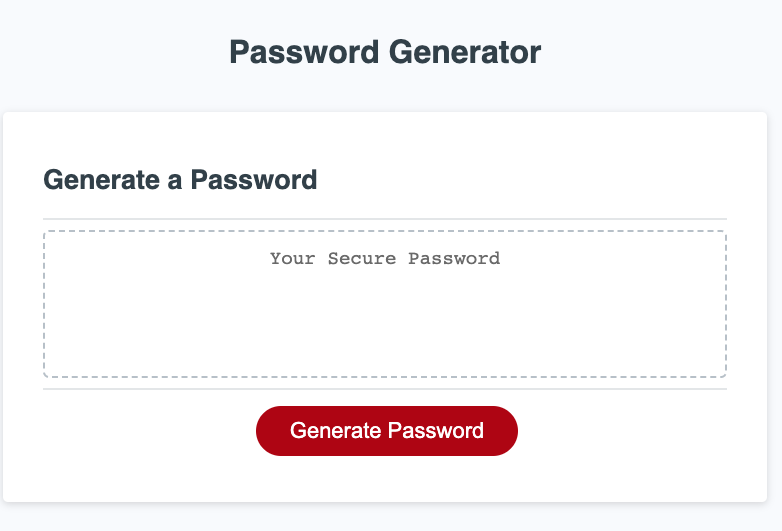

# Password Generator 

## User Story
AS AN employee with access to sensitive data

I WANT to randomly generate a password that meets certain criteria

SO THAT I can create a strong password that provides greater security

## Acceptance Criteria
GIVEN I need a new, secure password

WHEN I click the button to generate a password

THEN I am presented with a series of prompts for password criteria

WHEN prompted for password criteria

THEN I select which criteria to include in the password

WHEN prompted for the length of the password

THEN I choose a length of at least 8 characters and no more than 128 characters

WHEN asked for character types to include in the password

THEN I confirm whether or not to include lowercase, uppercase, numeric, and/or special characters

WHEN I answer each prompt

THEN my input should be validated and at least one character type should be selected

WHEN all prompts are answered

THEN a password is generated that matches the selected criteria

WHEN the password is generated

THEN the password is either displayed in an alert or written to the page

## Description

Once the page is open, simply click on the "Generate Password" button and follow the prompts.  You must choose a password length between 8 and 128 characters.  You have the option of choosing certain parameters, but one must be chosen.  Finally, your random password will be generated in the box.

The goal was to create a random password generator and hitting all the acceptance criteria listed above. 

This challenge took me more time than it probably should have.  I am learning a lot about myself.  I need to simplify and not overthink. I spent a lot of time learning the basics of JavaScript from other sites as well as our classwork.

## Table of Contents 

- [Usage](#usage)
- [Screenshot](#screenshot)
- [Credits](#credits)

## Usage

To navigate to this page, please [CLICK HERE](https://tygosley.github.io/password-generator-js/).  To use the Chrome DevTools, simply "right click" and use the inspect function or use keyboard shortcuts by press Command+Option+I (macOS) or Control+Shift+I (Windows).
  
## Screenshot

## Credits

Collaborators used:

[Codecademy](https://www.codecademy.com/learn)

[Khan Academy](https://www.khanacademy.org/)

[MDN Docs](https://developer.mozilla.org/en-US/)

[W3Schools](https://www.w3schools.com/js/default.asp)

[JavaScript.info](https://javascript.info/)

[CodeHS](https://codehs.com/)

